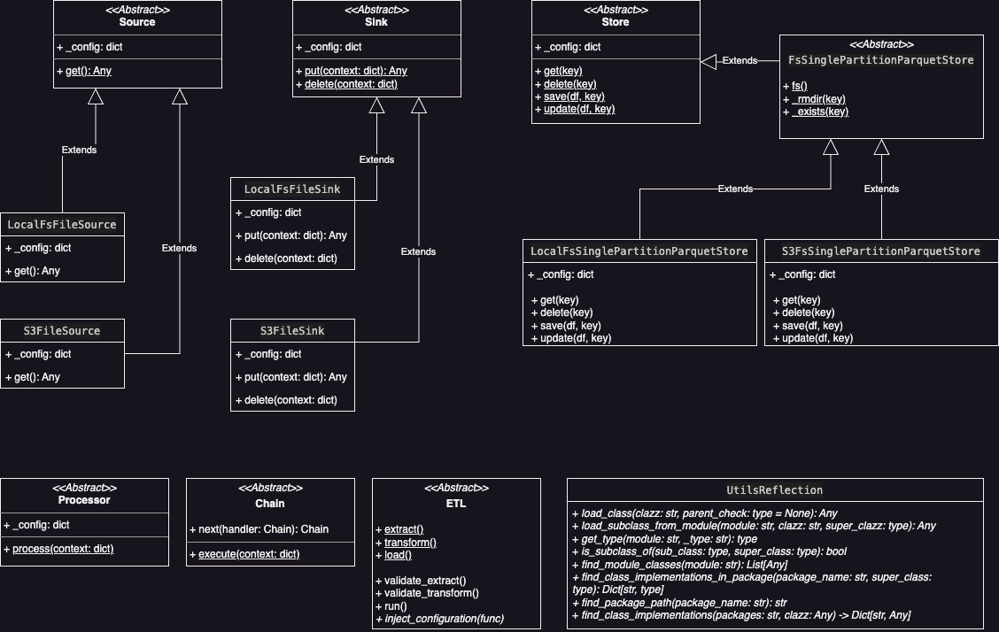

# dataops
data operations related code

## motivation
*dataops* is a library with tested and used code *"from the trenches"*, with the purpose to align on some standards regarding code structure and quality and to avoid reinventing small wheels

## current constructs

please check the unit tests code for usage examples

